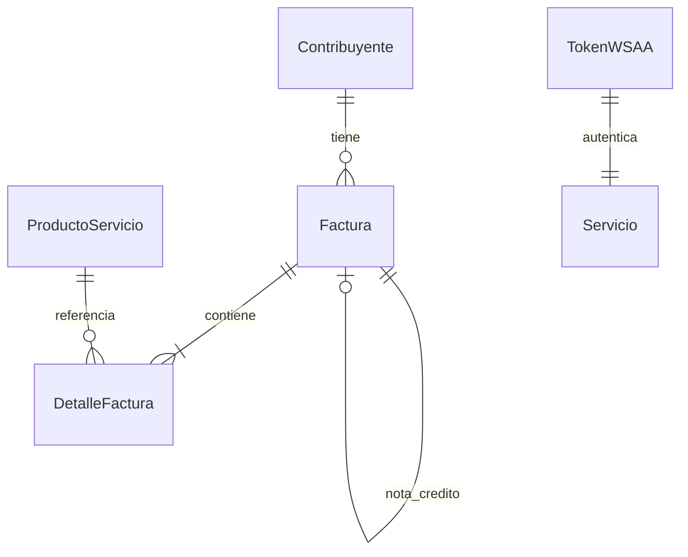

# ARCA Facturador v1.0.0

Sistema de Facturacion Electronica profesional para ARCA (ex AFIP) de Argentina.
Permite emitir Facturas A, B, C, Notas de Debito y Credito electronicas utilizando los Web Services WSFEv1 y WSAA.

## Arquitectura

```
ARCA_Facturador/
├── core/              # Logica de negocio (autenticacion, facturacion, validacion)
├── ui/                # Interfaz de usuario con CustomTkinter
├── database/          # Modelos ORM, repositorios y migraciones
├── reports/           # Generacion de PDF, Excel y XML
├── utils/             # Validadores, formateadores, encriptacion y logging
├── scripts/           # Scripts auxiliares (backup, migracion, limpieza)
├── web_dashboard/     # Dashboard web para Vercel
├── installer/         # Instalador NSIS para Windows
├── resources/         # Iconos, logos y recursos graficos
├── certs/             # Certificados digitales
├── data/              # Base de datos SQLite y backups
├── logs/              # Logs rotativos
└── temp/              # Archivos temporales
```

## Tecnologias

- **Python 3.10+** con PyAfipWs 3.x para integracion ARCA
- **CustomTkinter** para interfaz de escritorio moderna
- **SQLite** con WAL para persistencia local
- **FastAPI** para API REST interna
- **Firebase** para sincronizacion cloud
- **Vercel** para dashboard web complementario
- **ReportLab / OpenPyXL** para generacion de PDF/Excel

## Instalacion

### Windows
```
setup.bat
```

### Linux / Mac
```
chmod +x setup.sh
./setup.sh
```

### Inicio Rapido
```
# Windows
run.bat

# Linux / Mac
./run.sh
```

## Configuracion Inicial

1. Colocar certificado digital (.crt) y clave privada (.key) en `certs/`
2. Ejecutar la aplicacion e ir a la pestana **Configuracion**
3. Seleccionar archivos de certificado y clave
4. Ingresar CUIT emisor y punto de venta
5. Hacer clic en "Test Conexion ARCA"

## Uso

### Atajos de Teclado
- `F2` - Nueva factura
- `F5` - Generar factura
- `F12` - Abrir historial

### Flujo de Emision
1. Pestana **Facturacion** → Completar datos del cliente
2. Agregar items con descripcion, cantidad y precio
3. Hacer clic en **GENERAR FACTURA**
4. El sistema se comunica con ARCA y obtiene el CAE
5. Opcional: generar PDF, exportar XML

### Modo Offline
Si ARCA no esta disponible, las facturas se guardan como pendientes.
Use **Herramientas → Sincronizar Pendientes** cuando恢复 la conexion.

## API REST

La API interna se ejecuta en `http://127.0.0.1:8742`

```
GET  /health              Estado del servicio
POST /facturas/emitir     Emitir factura
GET  /facturas/{id}       Obtener factura
GET  /facturas            Listar facturas
GET  /clientes            Buscar clientes
GET  /estadisticas        Estadisticas
```

## Dashboard Web (Vercel)

El dashboard web se encuentra en `web_dashboard/` y se despliega en Vercel.
Muestra KPIs, graficos y facturas recientes consumiendo la API interna.

## Compilacion a Ejecutable Unico

```
pip install pyinstaller
pyinstaller build.spec
```

## Pruebas

```
pytest tests/ --cov=. --cov-report=term-missing
```

## Estructura de Base de Datos



## Licencia

Uso comercial y personal permitido.
